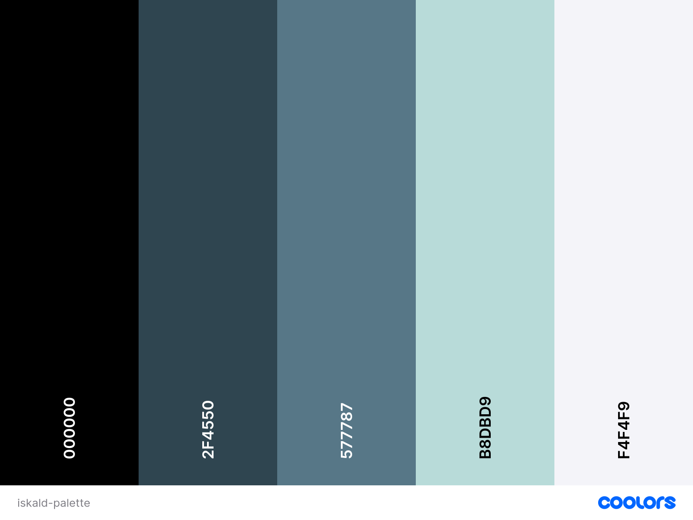
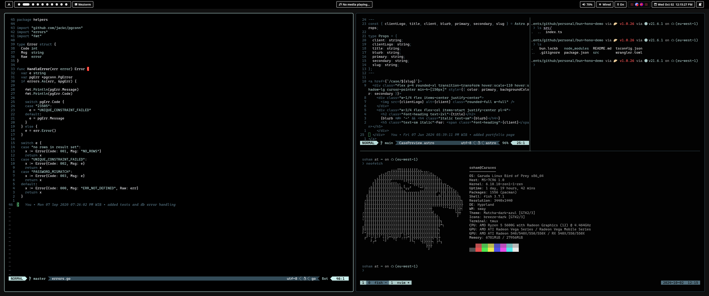

# Iskald (WIP)

I like clean and simple color schemes. Like many others, I started with monokai, and tried many including atom-one, rose-pine and tokyo night before settling on Catppuccin, but even those had _too many colours_ for me. Eventually I found zenbones which I liked, but was a bit too muted for me. So, I used a combination of Claude and ChatGPT, along with a color palette I generated on coolors, to create Iskald. 

## Before we talk about the theme 

I have my issues with AI, but I will admit, it has become an invaluable replacement to something like stackoverflow. It's great at helping me "google" my questions, and did a great job at helping me generate these themes. That being said, these themes are not perfect, so don't expect the refinement you would get from something like Cattpuccin or Rose Pine. 

## Colour Palette



```
 $black:       "#000000"
 $darkgrey:    "#2F4550"
 $medgrey:     "#577787"
 $lightblue:   "#B8DBD9"
 $offwhite:    "#F4F4F9"
```

## Screenshot




## How to install?  

Each theme's install instructions can be found in the programs individual folder. I like the idea of copy pasting more than installing via package managers, because then you have the control to check it into your own version control system, as well as make your own changes.


## FAQ 

### Can you do one for [insert_program_name_here]? 

Probably not. You have the colour palette above, feel free to do one yourself. Go to Claude or ChatGPT, paste in the palette, along with an example colour scheme from the program you want to make a theme for, and ask it to generate one for you. Here's the prompt I like to use;

```
I'd like to generate an accessible and legible colour scheme for [PROGRAM_NAME]. Please use the following palette pasted below, as well as give me instructions on how to install your generated palette. Please ensure that primary text uses the off-white colour, and don't use the darker colours for text as it may clash with the background. If needed, generate more colours based on the palette to fill in any gaps. Thank you! 

[TODO INSERT PALETTE]
```
